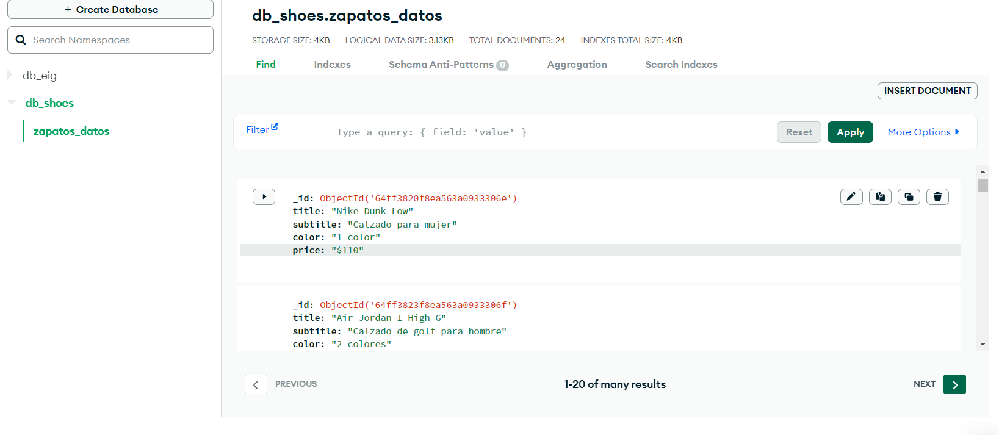

# Exámen

## Consigue extraer datos de una fuente de datos online
Por ejemplo:
una API web meteorológica, un portal inmobiliario o de venta de artículos de segunda mano,
extraer texto de pdfs o foros...

## Se extrajo datos de la pagina https://www.nike.com/us/es/ 👇

Tabla de contenidos:
---

En la pagina web de "NIKE", se consulto sobre zapatos con el fin de extraer datos como:
- Título
- Subtitulo
- Color disponible
- Precio
- Descuento

En el cual se almaceno la información en github:
- https://github.com/Dannii01/Examen1.git
-  ---

Se utilizo una herramienta de base de datos:

<h1 align="center"> MongoDB </h1>

 Guardamos la información que se extrajo de la pagina web

 

